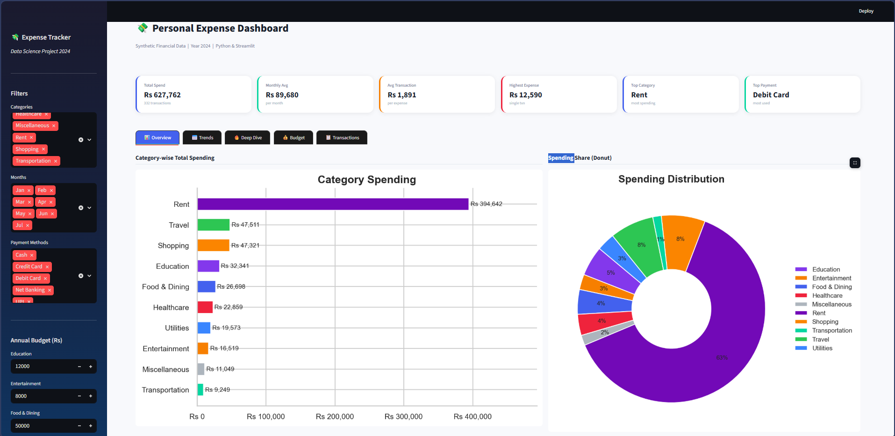
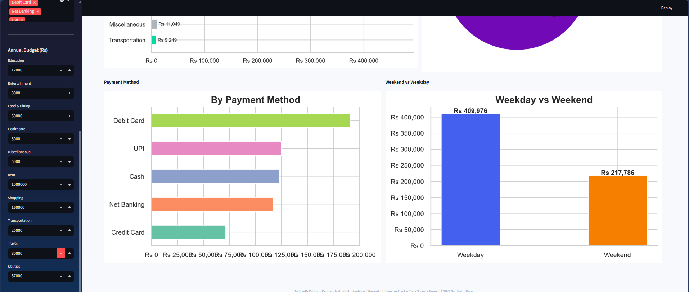
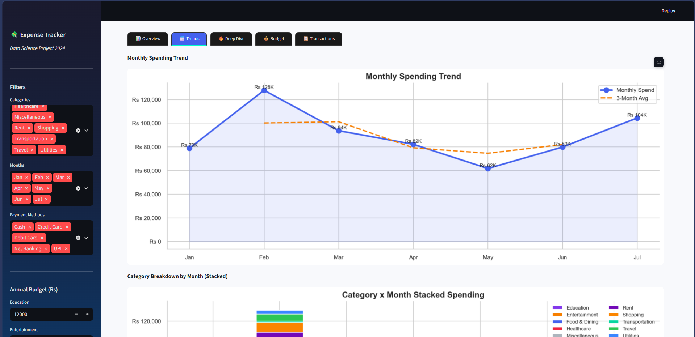
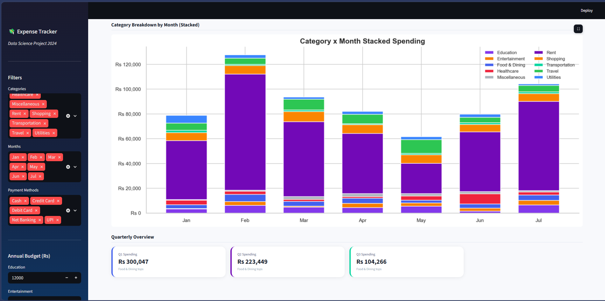
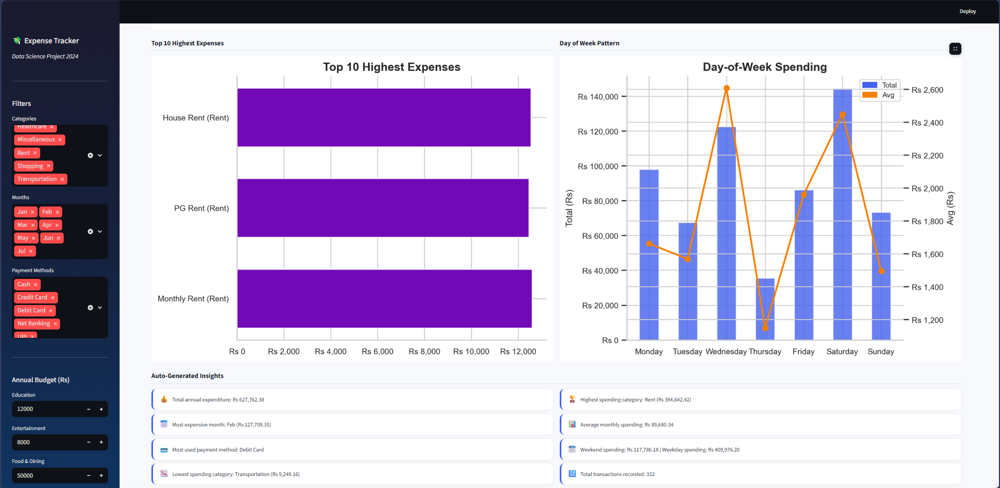
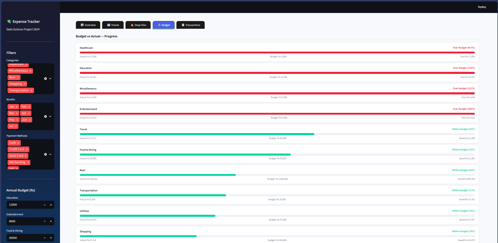
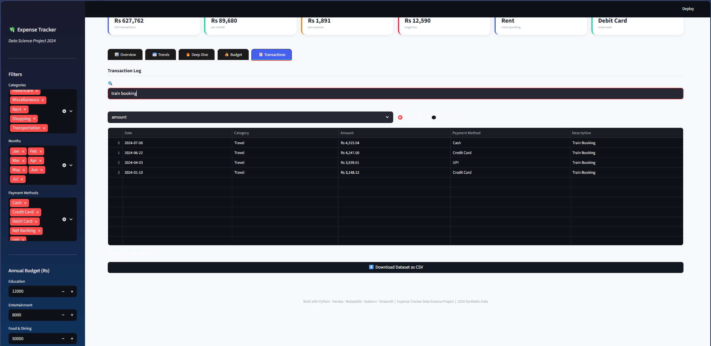

# 💸 Expense Tracker App — Data Science Project

> An end-to-end data science project that generates, cleans, analyzes,
> and visualizes personal expense data using Python, Pandas, Plotly, and Streamlit.

---

## Problem Statement

Managing personal or business finances requires tracking where money goes.
This project simulates a full expense tracking pipeline using **synthetic data**,
demonstrating real-world data analysis skills applicable to Data Analyst,
Business Analyst, and Financial Analyst roles.

---

## Features

- Synthetic expense data generator (600 records, 10 categories, 1 year)
- Full ETL pipeline: cleaning, feature engineering, aggregation
- 5-tab interactive Streamlit dashboard
- 8 static Matplotlib/Seaborn charts
- Budget vs actual comparison with progress bars
- Auto-generated text insights
- Transaction search and CSV download

---

## Tech Stack

| Tool | Purpose |
|---|---|
| Python 3.10+ | Core language |
| Pandas | Data manipulation |
| NumPy | Numerical ops |
| Matplotlib / Seaborn | Static charts |
| Plotly | Interactive charts |
| Streamlit | Dashboard UI |
| Faker | Synthetic data |

---

## Project Structure

```
Expense-Tracker-App/
├── data/
│   ├── raw/expenses.csv
│   └── processed/expenses_clean.csv
├── src/
│   ├── generate_data.py
│   ├── clean_data.py
│   ├── analyze.py
│   └── visualize.py
├── outputs/
│   ├── charts/         (8 PNG files)
│   └── reports/        (insights.txt)
├── app.py              (Streamlit dashboard)
├── main.py             (full pipeline runner)
├── requirements.txt
└── README.md
```

---

## How to Run

```bash
# 1. Clone the repo
git clone https://github.com/YOUR_USERNAME/expense-tracker-data-science.git
cd expense-tracker-data-science

# 2. Create virtual environment
python -m venv venv
source venv/bin/activate       # Mac/Linux
venv\Scripts\activate          # Windows

# 3. Install dependencies
pip install -r requirements.txt

# 4. Run full pipeline (generates data + charts)
python main.py

# 5. Launch the dashboard
streamlit run app.py
```

Open: http://localhost:8501

---

## Dashboard Tabs

| Tab | Content |
|---|---|
| Overview | KPI cards, category bar & pie, payment method, weekend vs weekday |
| Trends | Monthly line chart with rolling avg, stacked bar by month, quarterly |
| Deep Dive | Heatmap, top 10 expenses, day-of-week pattern, auto insights |
| Budget | Progress bars, budget vs actual grouped bar chart |
| Transactions | Searchable, sortable table + CSV download |

## Dashboard output








---

## Results (Sample)

- Total annual spend: ~₹5,10,000
- Rent is the largest category (~28%)
- Peak spending in October–November
- UPI is the most-used payment method
- Weekdays account for ~72% of total spend

---

## Future Improvements

- ML forecasting (Prophet / ARIMA)
- Real-time expense input form
- Email budget alerts
- Bank statement PDF parser
- Mobile app version

---

## Author

**[Seethaka Rakshitha]** | [LinkedIn]( https://www.linkedin.com/in/seethaka-rakshitha/) | [GitHub](https://github.com)

---

*Built as a placement project demonstrating data engineering, EDA, visualization, and dashboard skills.*
